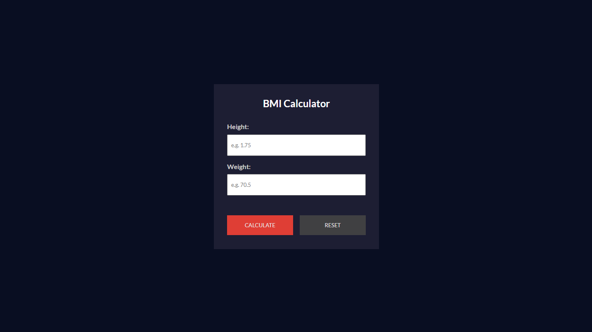
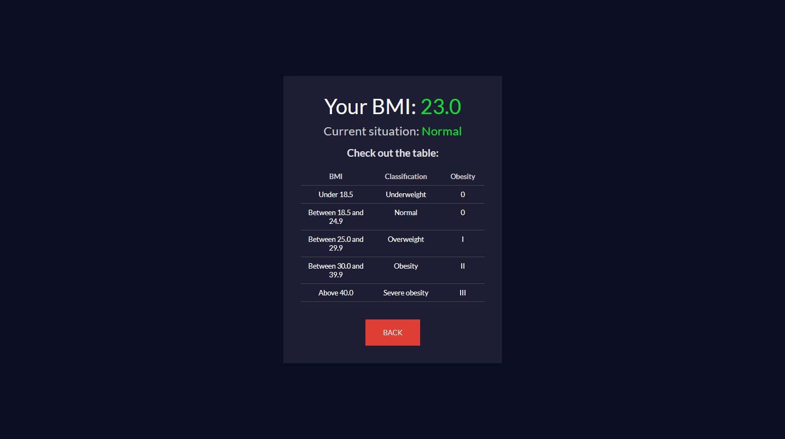

# BMI Calculator

BMI (Body Mass Index) calculator made with React and Vite. After the user enters their height and weight and clicks on "Calculate", their result and classification will be displayed, as well as an explanatory table of the body mass index and its categories.

## How to use

1. Clone this repository with `git clone https://github.com/mat-afk/bmi-calculator.git`.

2. Open the project folder `cd bmi-calculator` and run `npm install` to install dependencies.

3. Run `npm run dev` to start the app and open the indicated port to view it in the browser.

4. Enter your weight and height and click on the button to calculate your BMI.

5. View your results.

